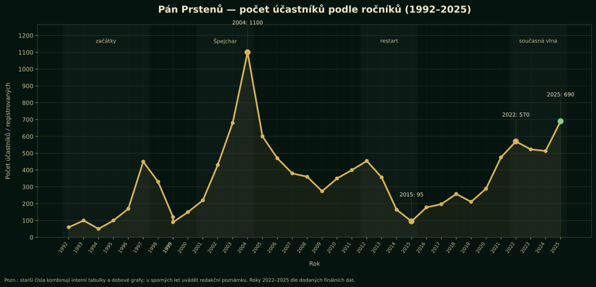

---

# SOUBOR: README.md

# Pán Prstenů — rozšířená stránka Minulé ročníky, verze 3

Balíček obsahuje rozšířené Markdown výstupy pro stránku **Minulé ročníky** a nový graf účastnosti za roky 1992–2025.

## Soubory

- `01-minule-rocniky-rozsirena-webova-verze.md` — hlavní rozšířený text připravený k publikaci.
- `02-blok-graf-ucastniku-pro-web.md` — samostatný blok s grafem, popiskem a HTML variantou pro vložení.
- `03-datove-poznamky-a-zdroje.md` — redakční poznámky k číslům a sporným rokům.
- `04-navrh-doplneni-aktualni-stranky.md` — praktický návod, kam na aktuální stránce doplnit nové prvky.
- `data/rocniky_pan_prstenu_1992_2025.csv` — sjednocená datová řada.
- `assets/graf-ucastniku-1992-2025-dark.svg` — doporučený graf pro web.
- `assets/graf-ucastniku-1992-2025-dark.png` — PNG varianta grafu.

## Důležité doplnění

Počty pro roky 2022–2025 byly opraveny podle finálních údajů:

- 2022: 570
- 2023: 523
- 2024: 513
- 2025: 690


---

# SOUBOR: 01-minule-rocniky-rozsirena-webova-verze.md

---
title: "Minulé ročníky Pána Prstenů"
description: "Rozšířená publikační verze historie larpu Pán Prstenů / Bitva o Středozem včetně dat, grafu účasti a podkladů pro web."
slug: "minule-rocniky"
updated: "2026-05-05"
---

# Minulé ročníky

## Třicet let kronika jedné komunity

Pán Prstenů není jen seznam bitev a dat v kalendáři. Je to kronika komunity, která se od roku 1992 opakovaně vrací do Středozemě, pokaždé trochu jinak a pokaždé s jinou generací hráčů, organizátorů a příběhů. První ročník v Rakoveckém údolí měl podle dochovaných tabulek zhruba 60 účastníků. O dvanáct let později se akce dostala přes hranici tisícovky a v novodobé vlně se znovu stabilizovala v řádu stovek lidí.

Za tu dobu se měnilo skoro všechno: místa, organizační týmy, pravidla, délka akce, důraz na bitvu nebo příběh i očekávání účastníků. Zůstalo ale několik věcí: Tolkienův svět jako společný jazyk, lesy a louky jako herní prostor, dobrovolnická práce v pozadí a chuť potkávat se u příběhu, který je větší než jeden víkend.

> **Redakční poznámka:** Čísla v historických pramenech nejsou vždy úplně stejná. Někdy jde o registrované osoby, někdy o reálné účastníky, jindy o kapacitu nebo pracovní odhad. V této verzi jsou pro graf použita sjednocená pracovní data; sporné roky jsou označeny poznámkou.

## Rychlý přehled

| Ukazatel | Hodnota |
|---|---:|
| Evidovaných datových záznamů v grafu | 35 |
| Součet evidovaných účastí / registrací | 11,857 |
| Průměr na jeden evidovaný ročník | 339 |
| Nejsilnější doložený ročník | 2004: 1100 |
| Nejsilnější novodobý ročník | 2025: 690 |
| Pět nejsilnějších záznamů | 2004 (1100), 2025 (690), 2003 (680), 2005 (600), 2022 (570) |

## Graf počtu účastníků



*Graf ukazuje dlouhodobý rytmus akce: skromné začátky, prudký růst na přelomu tisíciletí, vrchol ve špejcharské éře, pokles a restart po roce 2012 a současnou silnou vlnu po roce 2021. Roky 2022–2025 jsou doplněny podle finálních interních údajů: 570, 523, 513 a 690 účastníků.*

### Jak graf číst

Nejde o jednoduchou křivku popularity. Každá větší změna v grafu má svůj kontext. Růst mezi lety 2001 a 2004 souvisí s dobou velkého zájmu o fantasy a s možností pořádat akci ve větším zázemí. Pokles po roce 2005 neznamená jen úbytek zájmu, ale i přesuny míst, změnu generace organizátorů a náročnější bezpečnostní a organizační požadavky. Rok 2014 je potřeba číst jako narušený/zrušený ročník, nikoli jako běžnou účast. A roky 2022–2025 ukazují, že Pán Prstenů má i po více než třiceti letech schopnost znovu přitáhnout velké množství lidí.

## Příběh po etapách

### 1992–1997: začátky v Rakoveckém údolí

První ročník se konal v roce 1992 v Rakoveckém údolí. Dochovaná čísla uvádějí 60 účastníků. V raných letech šlo hlavně o dobrodružnou bitvu inspirovanou Tolkienem, přenesenou do reálné krajiny. Měřítko bylo menší, pravidla jednodušší a velká část kouzla stála na osobní domluvě, improvizaci a nadšení.

Roky 1993 až 1997 ukazují rychlé hledání formy. Akce se vracela do Rakoveckého údolí, ale objevily se i Dobříš a Jelení louky. V roce 1997 už tabulka uvádí 450 účastníků, tedy první opravdu velký skok. Pán Prstenů se tím posunul z menšího setkání do podoby výrazné fantasy bitvy.

Tuto dobu dobře vystihují pamětnické texty. Nejsou suchým zápisem vítězů a poražených, ale obrazem hry, v níž se vedle sebe potkávala epika, chaos, humor, únava, déšť, diplomacie i osobní hrdinství.

### 1998–2000: hledání míst a rozdvojený rok 1999

Konec devadesátých let je méně přehledný, ale právě proto historicky zajímavý. Rok 1998 je spojen s Českomoravskou vysočinou. Rok 1999 má dva záznamy: ročník 8A v Lutči mezi Brnem a Vyškovem a ročník 8 ve Vraném nad Vltavou. To ukazuje, že tradice se nevyvíjela jako dokonale rovná linie. Byla živá, místy rozvětvená a závislá na lidech, kteří byli zrovna ochotni a schopni akci nést.

Rok 2000 v Olešné u Havlíčkova Brodu je pak návratem k větší kontinuitě. Číslo 150 účastníků působí ve srovnání s pozdějším boomem menší, ale v kontextu tehdejší české larpové scény šlo pořád o výraznou akci.

### 2001–2004: špejcharská éra a velký růst

Rok 2001 přináší Křešice u Olbramovic a místo známé jako Špejchar. Právě tato etapa se stala jednou z nejvýraznějších v dějinách akce. V roce 2001 tabulka uvádí 220 účastníků, v roce 2002 už 430, v roce 2003 přibližně 680 a v roce 2004 vrcholných 1100.

Špejcharská éra spojila velký počet hráčů, silný příběhový rámec a možnost pořádat hru s většími národy, pevnostmi a rozsáhlejším terénem. Zároveň začala naplno ukazovat, že velká fantasy bitva není jen víkendová zábava, ale organizačně náročný projekt: doprava, zázemí, registrace, bezpečnost, zdravotníci, komunikace s účastníky, pravidla a odpovědnost za stovky lidí.

Rok 2003 je v pamětnických materiálech důležitý i příběhově. Dochované texty jej připomínají jako ročník, kdy se hra silně přiblížila knižnímu příběhu a kdy měl být po několika letech zničen Prsten. To je přesně typ události, která se z tabulky nedá vyčíst, ale v komunitní paměti zůstává.

### 2004–2009: vrchol, přesun a generační předání

Rok 2004 je první velký vrchol. Účast přesáhla tisíc lidí a Pán Prstenů se dostal do měřítka, které je i zpětně mimořádné. Taková velikost ale nese i cenu: větší tlak na organizátory, větší potřebu jasných pravidel, větší nároky na prostor, komunikaci a bezpečnost.

Po vrcholu následoval přesun a postupný pokles. Rok 2005 se odehrál na Tarnském panství u Berouna a tabulka uvádí kolem 600 účastníků. Od roku 2006 se akce přesouvá do Veverských Knínic. V této fázi se v organizaci vedle Jany „Jixipen“ Syrovátkové stále výrazněji objevuje Moravian LARP a mladší organizační generace.

Roky 2006 až 2009 nejsou slabou etapou, ale etapou přechodu. Po obrovských číslech přichází hledání udržitelnosti. Akce se zmenšuje, proměňuje a znovu si klade otázku, jak má vlastně moderní Pán Prstenů vypadat.

### 2010–2011: návrat k Rakoveckému údolí a dvacátý ročník

Rok 2010 přináší návrat do Rakoveckého údolí u Bukovinky a účast kolem 350 lidí. Rok 2011 je dvacátým ročníkem a v tabulce je uveden jako odhad kolem 400 účastníků. Z dnešního pohledu je to mezník: Pán Prstenů už nemusel být za každou cenu největší. Důležité bylo, že stále existuje, má tým a má komunitu, která se chce vracet.

Právě tady se dobře ukazuje síla tradice. Velké bitvy v Česku se postupně měnily, některé mizely, jiné se profesionalizovaly nebo zmenšily. Pán Prstenů ale přežil díky kombinaci paměti, osobních vazeb a ochoty znovu a znovu odpracovat množství neviditelné organizační práce.

### 2012–2015: restart pod názvem Bitva o Středozem

Od roku 2012 se častěji objevuje název **Pán Prstenů – Bitva o Středozem**. Interní a veřejné zdroje se zde místy rozcházejí, proto je dobré u těchto let rozlišovat registrace, veřejně uváděnou kapacitu a reálnou účast.

Rok 2012 má v interních datech 454, rok 2013 356. Rok 2014 je zvláštní a je potřeba jej vykládat opatrně: interní tabulka uvádí 164 registrací, ale zároveň poznámku, že akce byla zrušena kvůli počasí. Rok 2015 se pak pohybuje kolem 95 interně evidovaných účastníků. Navenek to působí jako propad, historicky je to ale spíš bod restartu. Akce se zmenšila, ale nezmizela.

### 2016–2021: obnova a nová organizační generace

Roky 2016–2021 jsou etapou obnovy. Po menším restartu se čísla pomalu zvedají: 178 v roce 2016, 197 v roce 2017, 258 v roce 2018, 211 v roce 2019, 289 v roce 2020 a 475 v roce 2021. Tato čísla ukazují, že se podařilo znovu vytvořit důvěru, rytmus a organizační kontinuitu.

Zároveň se proměňuje tým. Vedle Mealtinera se v dostupných podkladech objevují další organizátoři a spoluorganizátoři — Radis, Monty, Inzzi, Kristy, Špajda, Ozzyáš a další. To je pro historii zásadní: Pán Prstenů nikdy nebyl jen jedna osoba nebo jedna tabulka. Byl to opakovaně obnovovaný týmový projekt.

Roky 2020 a 2021 navíc probíhaly ve stínu pandemické situace. Přesto se právě po této době začíná znovu zvedat silná současná vlna.

### 2022–2025: současná silná vlna

Roky 2022 až 2025 ukazují Pána Prstenů jako živou a znovu rostoucí akci. Finální interní počty uvádějí 570 účastníků v roce 2022, 523 v roce 2023, 513 v roce 2024 a 690 v roce 2025. Rok 2025 je tak podle sjednoceného grafu druhým nejsilnějším evidovaným záznamem po vrcholu roku 2004.

Současná etapa je důležitá tím, že nefunguje jen jako nostalgie pro pamětníky. Přicházejí noví hráči, rodiny, mladší účastníci i lidé, kteří Pána Prstenů znají spíš jako otevřenou fantasy bitvu než jako historickou larpovou instituci. Tím se tradice znovu přepisuje: starý příběh dostává nové publikum.

## Co se v průběhu let měnilo

### Měřítko

Akce se pohybovala od desítek přes stovky až po více než tisíc účastníků. Největší nárůst přišel mezi lety 2001 a 2004. Novodobě se silná čísla vracejí po roce 2021.

### Forma hry

V různých obdobích se lišil důraz na bitvu, příběh, pochod, diplomacii, pevnosti, frakce i role pojmenovaných postav. Někdy šlo o kratší bitvu, jindy o víkendovou nebo vícedenní akci s rozsáhlejším zázemím.

### Organizace

V raných letech hrálo důležitou roli SPDP JRRT a jednotliví organizátoři navázaní na komunitu. Později se přidávaly ASF, Moravian LARP a novější okruh lidí kolem Bitvy o Středozem. Historie akce je proto zároveň historií předávání odpovědnosti mezi generacemi.

### Místa

Pán Prstenů se konal na řadě míst: Rakovecké údolí, Dobříš, Jelení louky, Českomoravská vysočina, Luteč, Vrané nad Vltavou, Olešná, Křešice u Olbramovic, Olbramovice, Beroun, Veverské Knínice, Rakovecké údolí u Bukovinky a novodobě Křtiny a okolí. Některá místa jsou doložená přesně, jiná zůstávají v paměti spíš jako orientační stopa.

## Vybrané archivní střípky

Tyto krátké pasáže je možné na webu použít jako samostatné boxy mezi kapitolami.

> „To je dost, že jdete, už tu na vás čekám.“  
> — Aragornovy paměti, Pán Prstenů 1992

> „Velmi vysokou travou postupovalo pět zvědů. Nesli jen své zbraně a nervy napjaté k prasknutí.“  
> — Petr Suchánek, Pán Prstenů 1995

> „Pořádat akce pro jiné, vidět, jak je hra baví, zpívat s nimi u ohňů, zpětně slýchat jejich vzpomínky a zážitky — prostě za to stojí.“  
> — vzpomínkový text k dvaceti letům Pána Prstenů

## Mýty a redakční poznámky

### „Pán Prstenů měl vždy jednu pevnou podobu.“

Neměl. V různých letech se měnila délka, místa, pravidla, míra příběhovosti i velikost. Právě proměnlivost je jedním z důvodů, proč akce přežila tak dlouho.

### „Pokles po roce 2004 znamenal konec zájmu.“

Ne tak jednoduše. Po rekordním ročníku přišla změna zázemí, organizační náročnost, generační proměna a hledání udržitelné velikosti. Graf ukazuje pokles, ale historie ukazuje spíš přechod a pozdější obnovu.

### „Rok 2014 je běžný ročník s malou účastí.“

Ne. V interních datech je u roku 2014 poznámka o zrušení kvůli počasí. Proto je vhodné jej v grafu a tabulce ponechat, ale v textu vysvětlit jako narušený ročník.

### „Současné ročníky jsou jen nostalgický návrat.“

Současná data tomu neodpovídají. Roky 2022–2025 ukazují stabilní vysokou účast a rok 2025 patří mezi nejsilnější evidované záznamy vůbec.

## Souhrnná tabulka ročníků

| Ročník | Rok | Datum | Místo | Počet | Poznámka |
|---|---:|---|---|---:|---|
| 1 | 1992 | — | Rakovecké údolí | 60 | První doložený ročník; v pracovním článku uváděn jako začátek tradice. |
| 2 | 1993 | 11. 6. – 13. 6. | Rakovecké údolí | 100 | Raná víkendová fáze. |
| 3 | 1994 | 27. 5. – 29. 5. | Dobříš | 50 | Jeden z ročníků mimo Moravu; přesné místo je v pamětnickém zdroji nejisté. |
| 4 | 1995 | 26. 5. – 28. 5. | Rakovecké údolí | 100 | Dochovaný rozsáhlý pamětnický report z pohledu Gondoru. |
| 5 | 1996 | 17. 5. – 19. 5. | Jelení louky / Hostýnské vrchy | 170 | Pamětnický soubor uvádí orientační souřadnice u rozcestí Pod Skalným. |
| 6 | 1997 | 2. 5. – 4. 5. | Rakovecké údolí | 450 | První velký skok účasti podle tabulkových dat. |
| 7 | 1998 | 29. 5. – 31. 5. | Českomoravská vysočina | 330 | Přesné místo není v pamětnickém zdroji spolehlivě vybavené; splývá s Olešnou. |
| 8A | 1999 | 18. 6. – 20. 6. | Luteč mezi Brnem a Vyškovem | 120 | Paralelní/alternativní ročník označený 8A. |
| 8 | 1999 | — | Vrané nad Vltavou | 90 | Druhý ročník v témže roce; pamětnicky spojovaný s ulicí Zvolská. |
| 9 | 2000 | 29. 4. – 1. 5. | Olešná u Havlíčkova Brodu | 150 | Začátek nástupu k větší kontinuitě na přelomu tisíciletí. |
| 10 | 2001 | — | Křešice u Olbramovic – Špejchar | 220 | První doložený ročník špejcharské etapy. |
| 11 | 2002 | 3. 5. – 5. 5. | Křešice u Olbramovic – Špejchar | 430 | Dochovaný report „Páni koní proti Pánu prstenů“. |
| 12 | 2003 | 8. 5. – 11. 5. | Křešice u Olbramovic – Špejchar | 680 | Dochované propozice a reporty; poprvé po čtyřech letech měl být podle reportu Prsten zničen. |
| 13 | 2004 | 7. 5. – 9. 5. | Olbramovice bez Špejcharu | 1100 | Vrchol první dvacetileté statistiky; interní tabulka uvádí i pracovní údaj 1150. |
| 14 | 2005 | 6. 5. – 8. 5. | Tarnské panství, Beroun | 600 | Přesun do Berouna; v pracovním textu začínají osobní vzpomínky současného autora. |
| 15 | 2006 | 5. 5. – 8. 5. | Veverské Knínice | 470 | První ročník ve Veverských Knínicích; začátek přebírání praktické organizace mladší generací. |
| 16 | 2007 | 11. 5. – 13. 5. | Veverské Knínice | 380 | Formální propojení s Moravian LARP. |
| 17 | 2008 | 8. 5. – 11. 5. | Veverské Knínice | 360 | Stabilizovaná knínická fáze. |
| 18 | 2009 | 15. 5. – 17. 5. | Veverské Knínice | 274 | Nejnižší bod po velkém boomu; podle interní tabulky vítěz „nikdo“. |
| 19 | 2010 | 25. 6. – 27. 6. | Rakovecké údolí u Bukovinky | 350 | Návrat k Rakoveckému údolí. |
| 20 | 2011 | 24. 6. – 26. 6. | neuvedeno v tabulce | odhad 400 | Dvacátý ročník; v tabulce uvedeno jako odhad. |
| 21 | 2012 | — | neuvedeno v interní tabulce; veřejné zdroje uvádějí Bitvu o Středozem | 454 interně; 500 veřejně | Veřejná Larpová databáze uvádí 500 hráčů a jednodenní formát; interní tabulka 454. |
| 22 | 2013 | — | neuvedeno v interní tabulce | 356 interně; 300 veřejně | Veřejná Larpová databáze uvádí 300 hráčů a jednodenní formát; interní tabulka 356. |
| 23 | 2014 | — | neuvedeno | 164 registrací | Interní tabulka výslovně uvádí: akce zrušena kvůli počasí. V publikované historii vykládat jako zrušený/poznamenaný ročník, ne jako běžnou účast. |
| 24 | 2015 | — | neuvedeno | 95 interně; 80 veřejně | Období restartu v menším měřítku. |
| 25 | 2016 | — | neuvedeno | 178 interně; 200 veřejně | Po roce 2015 začíná růstová obnova. |
| 26 | 2017 | — | neuvedeno | 197 interně; 200 veřejně | Postupná stabilizace nového organizačního okruhu. |
| 27 | 2018 | — | neuvedeno | 258 interně; 250 veřejně | Veřejné zdroje evidují třídenní akci se zhruba 250 hráči. |
| 28 | 2019 | — | neuvedeno | 211 interně | Interní tabulka uvádí maximum životů 4; veřejná karta existuje, ale nebyla detailně stažena. |
| 29 | 2020 | 28. 8. – 31. 8. | Křtiny | 289 interně; 350 veřejně | Pandemický ročník; veřejná Larpová databáze uvádí 350 hráčů. |
| 30 | 2021 | 27. 8. – 30. 8. | Křtiny, louka mezi Křtinami a Bukovinou | 475 interně; 350 na LARP.cz; 300 v Larpové databázi | Výrazný rozdíl zdrojů; publikovat s poznámkou, že čísla rozlišují registrace/účast/kapacitu. |
| 31 | 2022 | 25. 8. – 28. 8. | Křtiny, louka mezi Křtinami a Bukovinou | 570 | Finální počet účastníků doplněný z interních podkladů: 570. |
| 32 | 2023 | 24. 8. – 27. 8. | Křtiny, louka mezi Křtinami a Bukovinou | 523 | Finální počet účastníků doplněný z interních podkladů: 523. |
| 33 | 2024 | 22. 8. – 25. 8. | Křtiny, louka nad městem | 513 | Finální počet účastníků doplněný z interních podkladů: 513. |
| 34 | 2025 | 21. 8. – 24. 8. | uvidí se / veřejná karta bez upřesnění | 690 | Finální počet účastníků doplněný z interních podkladů: 690. |

## Prameny a podklady

### Interní a přiložené podklady

- `Dvacet let Pána prstenů.docx` — hlavní pamětnický a vyprávěcí zdroj, včetně pracovního článku k dvaceti letům akce.
- `tabulka.docx` a `tabulka.pdf` — základní tabulka ročníků 1992–2011 s místy, organizátory a počty.
- `graf.pdf` — původní graf počtu registrovaných účastníků do roku 2011.
- `jixipen-místa.txt` — pamětnické poznámky k lokalitám a orientačním souřadnicím některých starších míst.
- `tabulky.xlsx` — interní pracovní data pro pozdější ročníky.
- Finální doplnění počtů 2022–2025: 570, 523, 513, 690.

### Veřejné zdroje vhodné k ponechání v redakčních poznámkách

- LARP.cz — karty novějších ročníků Pána Prstenů / Bitvy o Středozem.
- Larpová databáze — starší veřejné karty ročníků po roce 2012.
- Larpy.cz — rozhovor a širší kontext vývoje českých velkých bitev.
- Crolarper / Kotaku — zahraniční zmínky dokládající, že akce měla přesah mimo úzkou českou komunitu.

## Doporučení pro webové zpracování

Na stránce bych graf nedával až dolů k tabulce. Nejlépe funguje hned po úvodním textu a krátkém přehledu čísel. Návštěvník tak rychle pochopí, že nejde jen o nostalgický článek, ale o opravdu dlouhou a datově doloženou historii.

Doporučené pořadí stránky:

1. Hero / nadpis „Minulé ročníky“.
2. Úvodní box „Třicet let kronika jedné komunity“.
3. Rychlý přehled čísel.
4. Graf účastnosti 1992–2025.
5. Vysvětlení grafu.
6. Příběh po etapách.
7. Archivní střípky.
8. Tabulka ročníků.
9. Prameny a poznámky k věrohodnosti.


---

# SOUBOR: 02-blok-graf-ucastniku-pro-web.md

# Blok pro vložení grafu účastnosti na web

Tento soubor je připravený jako samostatný blok, který lze vložit do stránky **Minulé ročníky**.

## Graf počtu účastníků


*Graf ukazuje vývoj počtu účastníků / registrovaných osob v letech 1992–2025. Starší hodnoty vycházejí z interních tabulek a původního grafu, novější ročníky jsou doplněny z pracovních dat a finální počty pro roky 2022–2025 jsou: 570, 523, 513 a 690.*

### HTML varianta pro vložení

```html
<figure class="history-chart">
  
  <figcaption>
    Vývoj počtu účastníků Pána Prstenů / Bitvy o Středozem v letech 1992–2025. Roky 2022–2025 jsou doplněny podle finálních interních údajů.
  </figcaption>
</figure>
```

### Krátký text pod graf

Pán Prstenů zažil několik výrazných vln. První růst přišel v devadesátých letech, největší vrchol nastal ve špejcharské éře kolem roku 2004 a po menším restartu po roce 2012 se akce znovu zvedla v současné etapě. Rok 2025 s 690 účastníky patří mezi nejsilnější evidované ročníky celé historie.

### Datový přehled

| Rok | Počet pro graf |
|---:|---:|
| 1992 | 60 |
| 1993 | 100 |
| 1994 | 50 |
| 1995 | 100 |
| 1996 | 170 |
| 1997 | 450 |
| 1998 | 330 |
| 1999 | 120 |
| 1999 | 90 |
| 2000 | 150 |
| 2001 | 220 |
| 2002 | 430 |
| 2003 | 680 |
| 2004 | 1100 |
| 2005 | 600 |
| 2006 | 470 |
| 2007 | 380 |
| 2008 | 360 |
| 2009 | 274 |
| 2010 | 350 |
| 2011 | 400 |
| 2012 | 454 |
| 2013 | 356 |
| 2014 | 164 |
| 2015 | 95 |
| 2016 | 178 |
| 2017 | 197 |
| 2018 | 258 |
| 2019 | 211 |
| 2020 | 289 |
| 2021 | 475 |
| 2022 | 570 |
| 2023 | 523 |
| 2024 | 513 |
| 2025 | 690 |


---

# SOUBOR: 03-datove-poznamky-a-zdroje.md

# Datové poznámky k historii Pána Prstenů

Tento soubor slouží jako redakční podklad k číslům a tabulkám na stránce **Minulé ročníky**.

## Sjednocená datová řada pro graf

Soubor: `data/rocniky_pan_prstenu_1992_2025.csv`

Pro graf se používá sloupec `graf`. Ten je záměrně číselný a sjednocený, aby šlo vykreslit souvislou řadu. Sloupec `pocet` naopak může obsahovat redakční poznámku typu „454 interně; 500 veřejně“.

## Sporné nebo citlivé roky

- **1999** — dva záznamy v jednom roce: 8A Luteč a 8 Vrané nad Vltavou. V grafu proto rok 1999 reprezentují dva body ve stejné oblasti; pro webovou tabulku je vhodné ponechat oba řádky.
- **2004** — vrchol historické účasti. Pracovní texty uvádějí přes tisíc účastníků; pro graf používáme 1100.
- **2014** — zrušeno / narušeno počasím. Číslo 164 nečíst jako běžnou účast.
- **2021** — výrazný rozdíl mezi interními a veřejnými údaji. Pro graf použita interní hodnota 475.
- **2022–2025** — opraveno podle finálních údajů dodaných uživatelem: 570, 523, 513, 690.

## Krátké závěry z dat

- Součet evidovaných účastí/registrací v datové řadě: **11,857**.
- Průměr na jeden evidovaný záznam: **339**.
- Nejvyšší bod: **2004 — 1100**.
- Nejsilnější novodobý bod: **2025 — 690**.
- Současná vlna 2022–2025 má průměr **574** účastníků na ročník.

## Doporučená formulace k číslům na web

> Počty uvádějí dostupná interní a veřejně dohledaná data. U starších a sporných ročníků se může lišit počet registrovaných, reálných účastníků a veřejně uváděná kapacita. Graf proto slouží jako orientační, ale ucelený obraz vývoje akce.


---

# SOUBOR: 04-navrh-doplneni-aktualni-stranky.md

# Návrh rozšíření aktuální stránky „Minulé ročníky“

Podle přiloženého screenshotu je stránka už dobře rozdělená na úvod, historické etapy, tabulku a prameny. Doporučuji ji rozšířit hlavně o tři věci: **rychlá čísla**, **graf účastnosti** a **konkrétnější archivní/pamětnické boxy**.

## 1. Co doplnit hned za úvodní box

### Rychlý přehled

| Ukazatel | Hodnota |
|---|---:|
| První doložený ročník | 1992 |
| Nejsilnější historický ročník | 2004 — 1100 |
| Nejsilnější novodobý ročník | 2025 — 690 |
| Současná vlna 2022–2025 | 570 / 523 / 513 / 690 |

### Vložit graf

```md

```

Text pod graf:

> Graf ukazuje, že Pán Prstenů má za sebou několik vln: skromné začátky, prudký růst na začátku tisíciletí, rekordní špejcharskou éru, pokles a restart po roce 2012 a novou silnou současnou etapu. Rok 2025 se 690 účastníky patří mezi nejsilnější evidované ročníky celé historie.

## 2. Kde rozšířit text

### V kapitole 1992–1997

Doplnit, že rané ročníky nebyly jen „menší“, ale také formativní: vznikal jazyk hry, způsob boje, představa frakcí a první pamětnické legendy.

### V kapitole 2001–2004

Doplnit více o špejcharské éře: největší růst, organizační náročnost, význam zázemí a posun od party nadšenců k velké akci pro stovky lidí.

### V kapitole 2012–2015

Zvýraznit, že nejde pouze o propad, ale o restart a hledání udržitelné podoby.

### V kapitole 2022–2025

Doplnit finální čísla:

- 2022: 570
- 2023: 523
- 2024: 513
- 2025: 690

A formulaci:

> Současná etapa ukazuje, že Pán Prstenů není jen nostalgická vzpomínka pamětníků. Přichází noví hráči, mladší účastníci i celé skupiny, pro které je Bitva o Středozem první velkou fantasy akcí.

## 3. Archivní boxy na stránku

Doporučuji vložit mezi kapitoly 2–3 krátké citace nebo vzpomínkové boxy. Nemají být dlouhé, spíš atmosférické.

### Box: Začátek příběhu

> „To je dost, že jdete, už tu na vás čekám.“  
> — Aragornovy paměti, Pán Prstenů 1992

### Box: Paměť bitvy

> „Velmi vysokou travou postupovalo pět zvědů. Nesli jen své zbraně a nervy napjaté k prasknutí.“  
> — Petr Suchánek, Pán Prstenů 1995

### Box: Proč se to celé dělá

> „Pořádat akce pro jiné, vidět, jak je hra baví, zpívat s nimi u ohňů, zpětně slýchat jejich vzpomínky a zážitky — prostě za to stojí.“

## 4. Poznámka k tabulce

Nad tabulku doporučuji vložit upozornění:

> U některých starších ročníků se liší interní a veřejně dohledané údaje. Tabulka proto nepracuje jen jako statistika, ale také jako pracovní kronika. Tam, kde jsou údaje nejisté, je ponechána redakční poznámka.

## 5. Co ještě doplnit později

- Fotografie ke každé etapě.
- Skeny starých pravidel / propozic.
- Samostatnou mapu míst konání.
- Krátké medailony hlavních organizátorů jednotlivých etap.
- Vítěznou stranu / hlavní příběhový výsledek u ročníků, kde je dohledatelný.
- Archiv ke stažení: pravidla, kroniky, plakáty, reporty, fotogalerie.
